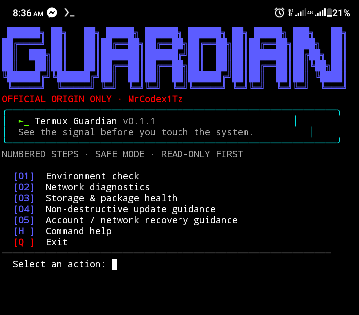

# Termux Guardian

> A safer command center for Android defenders who work in Termux.

**Owner:** MrCodex1Tz  ·  **Version:** 0.2.0  ·  **Mode:** defensive and non-destructive

Termux Guardian is an English-language toolkit for visibility, safe environment checks, network diagnostics, storage health, update guidance, and authorized recovery guidance. It is designed to help people understand their own devices without crossing into credential access or destructive behavior.



## Safety comes first

Termux Guardian **never extracts, reveals, stores, or displays Wi-Fi passwords, tokens, keys, cookies, or any other credentials**. Network diagnostics inspect connectivity, DNS, interface names, and Android metadata only. If you forgot a password, use Android Settings, the router or ISP's official recovery flow, or the account provider's official recovery page.

Use this project only on devices, networks, and accounts you own or are explicitly authorized to administer. Do not use it to bypass access controls, intercept traffic, evade detection, or access someone else's data.

## Install in Termux

The normal public flow does **not** require `gh auth login`. It clones only the official origin, verifies the origin, and then starts the numbered menu. The repository is currently **private**, however, so anonymous cloning cannot work until the owner makes it public or grants your GitHub account access.

When the repository is public, use this numbered flow:

```bash
1. pkg update
2. pkg install -y git bash curl iproute2
3. curl -fsSL https://raw.githubusercontent.com/King-pe/termux-guardian/main/install.sh | bash
```

For the current private repository, an authorized owner or collaborator must authenticate before cloning:

```bash
pkg update
pkg install -y git bash curl iproute2 gh
gh auth login
gh repo clone King-pe/termux-guardian "$HOME/termux-guardian"
cd "$HOME/termux-guardian"
bash termuxguardian.sh
```

The installer prints blue numbered steps, red failure messages, checks GitHub before cloning, verifies that `origin` is exactly `King-pe/termux-guardian`, and stops with one clear message. It never continues to `cd`, `chmod`, or run a missing file after a failed clone. Review every command before running it.

### Troubleshooting a GitHub timeout

Run this check first:

```bash
curl -I --connect-timeout 10 https://github.com
```

If it times out, switch networks or retry later; Termux mirrors working does not prove that GitHub is reachable from the current network. If GitHub responds but cloning says access is denied, authenticate with `gh auth login` or ask the repository owner for access. The follow-up errors `cd: termux-guardian: No such file or directory`, `chmod: cannot access`, and `./termuxguardian.sh: No such file` are only consequences of the clone failing.

## Command reference

| Command | What it does | Changes files? |
| --- | --- | --- |
| `./termuxguardian.sh` | Opens the navigable menu | No |
| `./termuxguardian.sh check` | Prints safe environment metadata and storage summary | No |
| `./termuxguardian.sh network` | Checks connectivity, DNS, and interface names | No |
| `./termuxguardian.sh dns` | Checks system DNS, then falls back to `nslookup`/`dig` against 1.1.1.1 | No |
| `./termuxguardian.sh storage` | Checks home usage and package index readability | No |
| `./termuxguardian.sh updates` | Prints reviewed, manual update steps | No |
| `./termuxguardian.sh recovery` | Prints official recovery paths for forgotten access | No |
| `./termuxguardian.sh location` | Reads Termux:API location and optionally opens OpenStreetMap | Reads location; opens map only after `OPEN` |
| `./termuxguardian.sh scan quick` | Scans common download locations and the home directory for malware-risk patterns | No |
| `./termuxguardian.sh scan full` | Performs a deeper local scan; uses ClamAV when installed | No |
| `./termuxguardian.sh quarantine` | Reviews findings and moves confirmed files into private quarantine | Moves only after confirmation |
| `./termuxguardian.sh link <URL>` | Analyzes a URL locally without opening or downloading it | No |
| `./termuxguardian.sh help` | Prints CLI help and safety policy | No |

## Malware scanning and cleaning

Choose **[06] Quick malware-risk scan** for a fast check of common download locations, or **[07] Full malware-risk scan** for a deeper home-directory scan. If `clamscan` is installed, the tool uses it; otherwise it applies conservative local heuristics to suspicious executable scripts and packages. It never executes scanned files.

If findings appear, choose **[08] Review / quarantine findings**. The tool prints every finding and requires you to type `QUARANTINE` before moving anything. Quarantine is reversible storage under `~/.termux-guardian/quarantine`; it is not silent deletion. A heuristic result is not proof of infection, so review files carefully and use a trusted antivirus engine for confirmation.

## Link safety analysis

Choose **[09] Scan a link** or run `./termuxguardian.sh link "https://example.com"`. The analyzer does not open, resolve, download, or submit the URL. It flags patterns such as raw IP hosts, punycode domains, URL shorteners, embedded credentials, and credential-themed wording. A green **SAFE LINK** result means no obvious local warning pattern was found, not a guarantee. A red **DANGER / PHISHING RISK** result means **do not open this link**.

## Repository activity

The companion dashboard now shows live public GitHub repository signals: forks, stars, watchers, open issues, and last update. These are community activity signals, not a hidden user tracker. GitHub does **not** expose public visitor or unique-user counts for most repositories: traffic views require repository-owner access. The dashboard therefore shows `N/A` rather than inventing a number. If you have owner access, use **GitHub → Insights → Traffic** for views and unique visitors.

| Metric | Source | Status |
| --- | --- | --- |
| Forks | GitHub repository API | Loaded on the dashboard when available |
| Stars | GitHub repository API | Loaded on the dashboard when available |
| Visitors | GitHub Insights → Traffic | Owner-only; not faked |

## DNS and My Location Maps

If the menu shows DNS as `not confirmed`, run:

```bash
pkg install -y dnsutils
./termuxguardian.sh dns
```

The tool first checks the Android/system resolver, then tries `nslookup` or `dig` through `1.1.1.1`. It does not silently rewrite Android network settings. If the fallback works but the system resolver fails, review Android **Private DNS**, switch networks, or restart the network connection.

For location maps, install the Termux:API app from the same trusted source as Termux and then:

```bash
pkg install -y termux-api
./termuxguardian.sh location
```

Grant location permission when Android asks. The command reads coordinates locally, shows the OpenStreetMap URL, and asks you to type `OPEN` before launching it. Coordinates are not stored by Termux Guardian.

## Ownership and forks

MrCodex1Tz is the project owner and maintainer. `.github/CODEOWNERS` requests owner review for changes to the toolkit, safety policy, documentation, and governance files. The CLI also refuses to run when `origin` is not exactly `github.com/King-pe/termux-guardian`.

A GitHub fork is a separate repository controlled by its fork owner. No upstream project can technically prevent a fork owner from changing their own fork, changing its organization, or transferring it. What this project enforces is that the official executable runs only from the official origin; forks can still be inspected or developed separately, but they are not treated as the official runtime source.

## Development

Run the local dashboard without installing dependencies:

```bash
python3 server.py
# open http://127.0.0.1:3000
```

Run the shell smoke tests:

```bash
bash tests/test_toolkit.sh
```

## License and contributions

Contributions are welcome through pull requests that preserve the safety boundary. Read [CONTRIBUTING.md](CONTRIBUTING.md), [SECURITY.md](SECURITY.md), and [CODE_OF_CONDUCT.md](CODE_OF_CONDUCT.md) before contributing. A contribution does not transfer ownership of the project, its name, or its official infrastructure.
